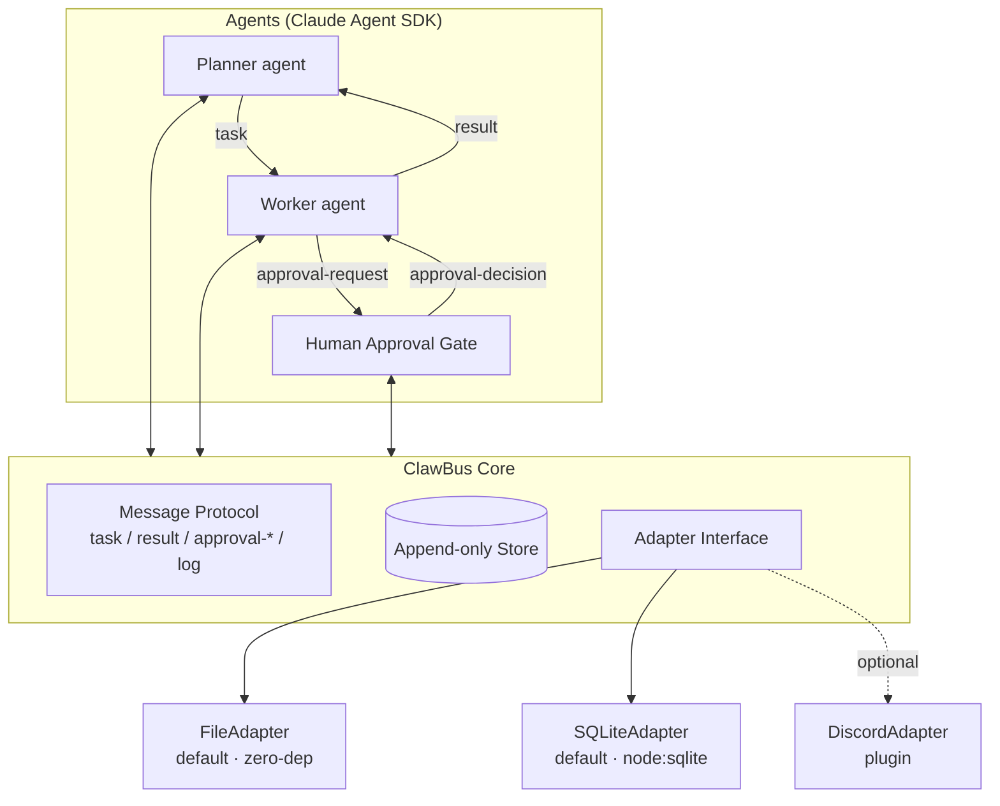

# ClawBus

> **A minimal protocol turning multiple Claude Code sessions into an observable, auditable agent team.**

Claude Code is powerful as a single coding agent, but real work usually needs a team — planning, investigation, implementation, review, and human approval. ClawBus defines a minimal protocol and reference implementation so multiple Claude Code / Claude Agent SDK sessions can delegate subtasks, share context, and surface decisions that need human sign-off.

This repository is the submission for **Built with Opus 4.7: a Claude Code Hackathon** (Cerebral Valley × Anthropic, 2026-04-21 – 2026-04-26).

---

## TL;DR for hackathon reviewers

```bash
git clone https://github.com/tokimwc/clawbus.git
cd clawbus
npm install
npm run build
export ANTHROPIC_API_KEY=sk-ant-...
npx clawbus demo
```

You should see:

1. A **Planner** agent decompose a toy task (`examples/broken-node-project` has a bug).
2. A **Worker** agent investigate and propose a patch.
3. A **Human Approval Gate** pause at the terminal asking you to approve/reject.
4. On approval, the patch is applied and `npx clawbus logs` shows the full causal timeline of messages.

Everything runs locally on SQLite. Nothing leaks to Discord or the cloud unless you opt in with the `DiscordAdapter` plugin. See [`docs/judging-guide.md`](docs/judging-guide.md) for a 5-minute review checklist.

---

## Why a "bus"?

Individual Claude Code agents are stateful and great at deep work, but coordinating more than one quickly degenerates into copy-pasting context between tabs. ClawBus replaces that with three ideas:

1. **A message protocol** (`task`, `result`, `approval-request`, `approval-decision`, `log`) — small enough to memorize, expressive enough for planner / worker / reviewer patterns.
2. **An append-only message store** — every agent utterance is persisted with a causal parent link, so any run is auditable after the fact.
3. **Swappable adapters** — the same protocol rides on local files, SQLite, Discord, or (in future) Slack / Redis / NATS. Core code doesn't know or care.

This repo ships the Core + FileAdapter + SQLiteAdapter + a working Planner / Worker / Human-Approval loop using the [Claude Agent SDK](https://docs.claude.com/en/agent-sdk/overview). The DiscordAdapter is provided as an **optional plugin** so you can run ClawBus across machines if you want — but the hackathon demo is entirely local so reviewers can reproduce it in a single shell.

---

## Architecture



See [`docs/protocol.md`](docs/protocol.md) for the message schema and [`docs/quickstart.md`](docs/quickstart.md) for how to wire your own agents.

---

## Install

```bash
npm install clawbus
```

Node ≥ 22.5 (uses the built-in `node:sqlite` — no native compile step). If you're on an older Node, use the `FileAdapter` instead.

---

## Minimal example

```typescript
import { ClawBus, SQLiteAdapter } from "clawbus";

const bus = new ClawBus({
  adapter: new SQLiteAdapter({ path: ".clawbus/bus.sqlite" }),
});

await bus.subscribe("worker", async (msg) => {
  if (msg.kind !== "task") return;
  await bus.send({
    to: msg.from,
    kind: "result",
    parent: msg.id,
    payload: { text: `did: ${JSON.stringify(msg.payload)}` },
  });
});

const { id } = await bus.send({
  from: "planner",
  to: "worker",
  kind: "task",
  payload: { goal: "say hello" },
});

const result = await bus.waitFor({ parent: id, kind: "result" });
console.log(result.payload);
```

---

## What's novel

Compared to building a bespoke coordination layer per project, ClawBus gives you:

- **A protocol, not a framework.** Five message kinds. The rest is up to your agents.
- **Observability by default.** Every agent message is append-only and queryable.
- **Human-in-the-loop as a first-class kind** (`approval-request` / `approval-decision`), not bolted on.
- **Adapter pluralism.** Local for dev, Discord for distributed teams, bring-your-own for whatever comes next.

---

## Hackathon compliance notice

This repository was created from scratch during the hackathon window (initial commit `2026-04-22` JST, after the `2026-04-21 12:00 PM EDT` kickoff). The **design** is informed by a production multi-agent system I've been running across a 5-node home cluster ("Claw family"), but **no code from that system is reused here** — everything in `src/`, `docs/`, and `examples/` is new work authored for this submission. See `docs/judging-guide.md` for how to audit that claim.

---

## License

[MIT](./LICENSE) © 2026 tokimwc

---

## Roadmap (post-hackathon)

- SlackAdapter + NATSAdapter
- Persistent scheduler (cron-style agent triggers)
- Web dashboard for the message timeline
- Integration recipe with n8n / GitHub Actions / local dev loops

Contributions welcome once the hackathon judging window closes.
