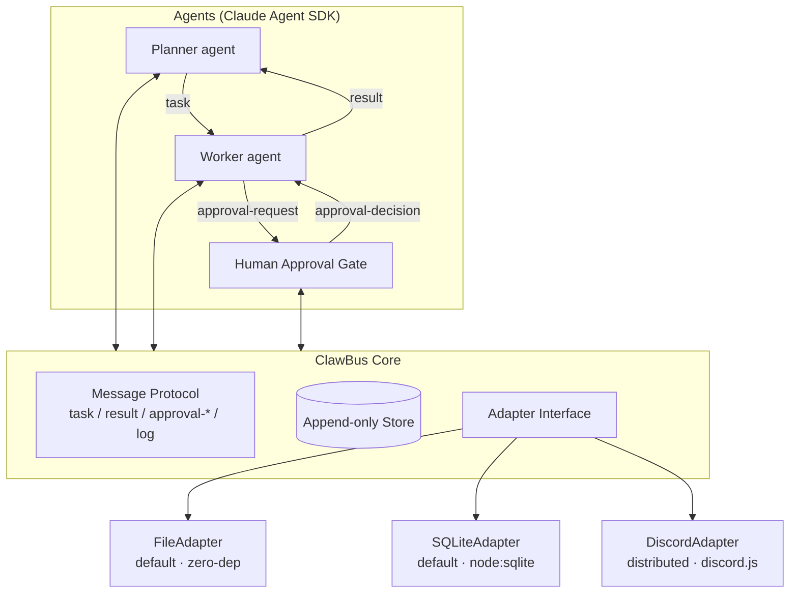
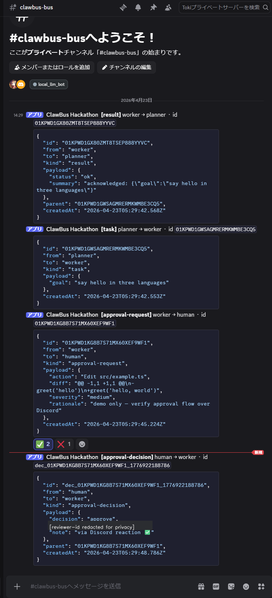

# ClawBus

> **A minimal protocol turning multiple Claude Code sessions into an observable, auditable agent team.**

**Claude Code is excellent per session. ClawBus makes cross-session coordination auditable without inventing a new runtime.**

Claude Code is powerful as a single coding agent, but real work usually needs a team — planning, investigation, implementation, review, and human approval. ClawBus defines a minimal protocol and reference implementation so multiple Claude Code / Claude Agent SDK sessions can delegate subtasks, share context, and surface decisions that need human sign-off.

This repository is the submission for **Built with Opus 4.7: a Claude Code Hackathon** (Cerebral Valley × Anthropic, 2026-04-21 – 2026-04-26).

---

## TL;DR for hackathon reviewers

```bash
git clone https://github.com/tokimwc/clawbus.git
cd clawbus
npm install
npm run build
export ANTHROPIC_API_KEY=sk-ant-...
npx clawbus demo
```

You should see:

1. A **Planner** agent decompose a toy task (`examples/broken-node-project` has a bug).
2. A **Worker** agent investigate and propose a patch.
3. A **Human Approval Gate** pause at the terminal asking you to approve/reject.
4. On approval, the patch is applied and `npx clawbus logs` shows the full causal timeline of messages.

Everything runs locally on SQLite. No network calls except to the Anthropic API. See [`docs/judging-guide.md`](docs/judging-guide.md) for a 5-minute review checklist with branches for "no API key" vs "with API key" reviewers.

**No API key handy?** The [judging guide](docs/judging-guide.md) and [`docs/scenarios/`](docs/scenarios/) contain three captured end-to-end runs with full message timelines and costs. The whole protocol fits in two pages — see [`docs/protocol.md`](docs/protocol.md).

**Want the longer argument?** [`docs/manifesto.md`](docs/manifesto.md) explains why we built this and — more importantly — what we deliberately didn't build.

---

## Why a "bus"?

Individual Claude Code agents are stateful and great at deep work, but coordinating more than one quickly degenerates into copy-pasting context between tabs. ClawBus replaces that with three ideas:

1. **A message protocol** (`task`, `result`, `approval-request`, `approval-decision`, `log`) — small enough to memorize, expressive enough for planner / worker / reviewer patterns.
2. **An append-only message store** — every agent utterance is persisted with a causal parent link, so any run is auditable after the fact.
3. **Swappable adapters** — the same protocol rides on local files, SQLite, or Discord today; the adapter interface is the seam for additional transports (Slack / NATS / Redis) when you need them. Core code doesn't know or care.

This repo ships the Core + FileAdapter + SQLiteAdapter + DiscordAdapter + a working Planner / Worker / Human-Approval loop using the [Claude Agent SDK](https://docs.claude.com/en/agent-sdk/overview). All three adapters are exercised by the test suite, and the DiscordAdapter has a real-bot end-to-end recipe in [`docs/scenarios/discord-handshake.md`](docs/scenarios/discord-handshake.md). The hackathon demo is entirely local so reviewers can reproduce it in a single shell.

---

## What ClawBus is *not*

- **Not a scheduler.** Agents pull or push messages on their own clock. There is no built-in cron.
- **Not a workflow engine.** No DAGs, no retries, no compensation logic in Core. Your agents own those decisions.
- **Not a new agent runtime.** Agents stay as Claude Code / Claude Agent SDK sessions; ClawBus only carries messages between them.
- **Just a protocol + log + adapters.** The interesting work happens in your agents.

---

## The five message kinds

| Kind | Purpose | Why it's a separate kind |
|---|---|---|
| `task` | Delegate a goal to another agent | The unit of work hand-off |
| `result` | Report success or completion of a task | Closes a `task` without overloading other kinds |
| `approval-request` | Pause a mutation with inspectable intent | The gate doesn't pause on vibes — it pauses on a fully inspectable message |
| `approval-decision` | Record human sign-off as a first-class event | The audit log shows *who* approved *what* and *when* |
| `log` | Operational breadcrumbs (non-terminal) | Preserves observability without polluting `result` semantics |

That's the entire surface. Five kinds, append-only, with a causal `parent` link on every message. See [`docs/protocol.md`](docs/protocol.md) for the schema.

---

## Architecture



See [`docs/protocol.md`](docs/protocol.md) for the message schema and [`docs/quickstart.md`](docs/quickstart.md) for how to wire your own agents.

---

## Install

```bash
npm install clawbus
```

Node ≥ 22.5 (uses the built-in `node:sqlite` — no native compile step). If you're on an older Node, use the `FileAdapter` instead.

---

## Minimal example

```typescript
import { ClawBus, SQLiteAdapter } from "clawbus";

const bus = new ClawBus({
  adapter: new SQLiteAdapter({ path: ".clawbus/bus.sqlite" }),
});

await bus.subscribe("worker", async (msg) => {
  if (msg.kind !== "task") return;
  await bus.send({
    to: msg.from,
    kind: "result",
    parent: msg.id,
    payload: { text: `did: ${JSON.stringify(msg.payload)}` },
  });
});

const { id } = await bus.send({
  from: "planner",
  to: "worker",
  kind: "task",
  payload: { goal: "say hello" },
});

const result = await bus.waitFor({ parent: id, kind: "result" });
console.log(result.payload);
```

### With DiscordAdapter (distributed)

The same code, just swap the adapter to coordinate across machines via a shared Discord channel:

```typescript
import { ClawBus, DiscordAdapter } from "clawbus";

const bus = new ClawBus({
  adapter: new DiscordAdapter({
    token: process.env.DISCORD_BOT_TOKEN!,
    channelId: process.env.DISCORD_CHANNEL_ID!,
    reviewerIds: ["<your-discord-user-id>"], // who can ✅/❌ approval-requests
  }),
});

await bus.connect();
// ... rest of the code is identical ...
```

When the bus sends an `approval-request`, the adapter posts it to the channel and attaches ✅ / ❌ reactions. A reaction from an authorized reviewer's Discord account becomes an `approval-decision` message on the bus — the same shape your worker would have received locally.



See [`docs/scenarios/discord-handshake.md`](docs/scenarios/discord-handshake.md) for the recorded round-trip with full message bodies.

---

## What's novel

Compared to building a bespoke coordination layer per project, ClawBus gives you:

- **A protocol, not a framework.** Five message kinds. The rest is up to your agents.
- **Observability by default.** Every agent message is append-only and queryable.
- **Human-in-the-loop as a first-class kind** (`approval-request` / `approval-decision`), not bolted on.
- **Adapter pluralism.** Three working adapters today (`FileAdapter` for zero-dep, `SQLiteAdapter` for queryability, `DiscordAdapter` for distributed teams with built-in human-in-the-loop via reactions). The adapter interface is the seam for additional transports — bring your own when you need them.

---

## Real run logs

Three captured end-to-end runs in [`docs/scenarios/`](docs/scenarios/), so reviewers can audit the system without burning their own API credits:

| Scenario | Adapter | What it shows | API spend |
|---|---|---|---:|
| [`run-01-fizzbuzz.md`](docs/scenarios/run-01-fizzbuzz.md) | SQLiteAdapter | **Bug fix** — Planner decomposes 1 goal → 3 subtasks; worker runs tests, finds the bug, requests approval, applies the fix, re-runs tests | **$0.0794** |
| [`run-02-feature-add.md`](docs/scenarios/run-02-feature-add.md) | SQLiteAdapter | **New feature** — Worker reads a comment-only spec, writes the source and the tests (2 approval-requests), all 4 tests pass | **$0.0945** |
| [`discord-handshake.md`](docs/scenarios/discord-handshake.md) | DiscordAdapter | **Same protocol, distributed** — `approval-request` posted to a real Discord channel; human ✅ reaction becomes an `approval-decision` message | $0 (Discord) |

Each doc contains the verbatim CLI stdout, the full append-only message
timeline (every `clawbus logs` line), and — for the mutating runs — the
exact diffs the worker applied.

---

## Hackathon compliance notice

This repository was created from scratch during the hackathon window (initial commit `2026-04-22` JST, after the `2026-04-21 12:00 PM EDT` kickoff). The **design** is informed by a production multi-agent system I've been running across a 5-node home cluster ("Claw family"), but **no code from that system is reused here** — everything in `src/`, `docs/`, and `examples/` is new work authored for this submission. See `docs/judging-guide.md` for how to audit that claim.

---

## License

[MIT](./LICENSE) © 2026 tokimwc

---

## Roadmap (post-hackathon)

- **Claude Managed Agents adapter**: delegate worker execution to [Managed Agents](https://platform.claude.com/docs/en/managed-agents/overview) while ClawBus keeps coordination and audit — the "brain detached from hands" pattern, now at the bus level.
- **More distributed adapters**: SlackAdapter, NATSAdapter, RedisAdapter (DiscordAdapter is already shipped — see [`docs/scenarios/discord-handshake.md`](docs/scenarios/discord-handshake.md))
- Persistent scheduler (cron-style agent triggers)
- Web dashboard for the message timeline
- Integration recipe with n8n / GitHub Actions / local dev loops

Contributions welcome once the hackathon judging window closes.
